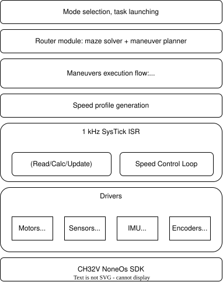
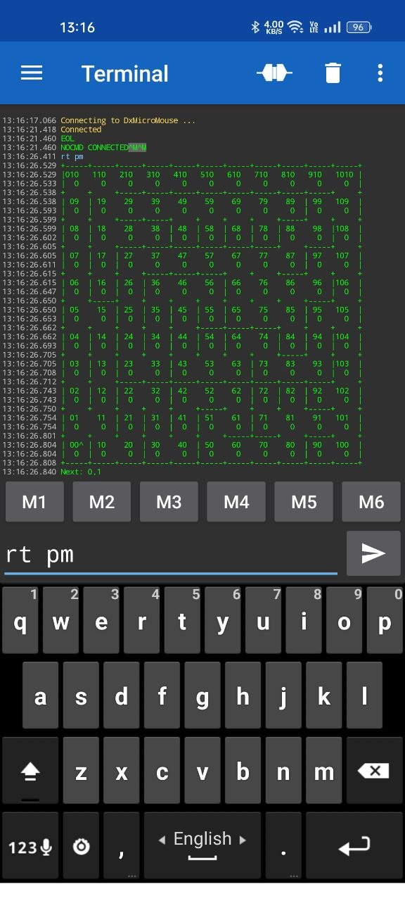
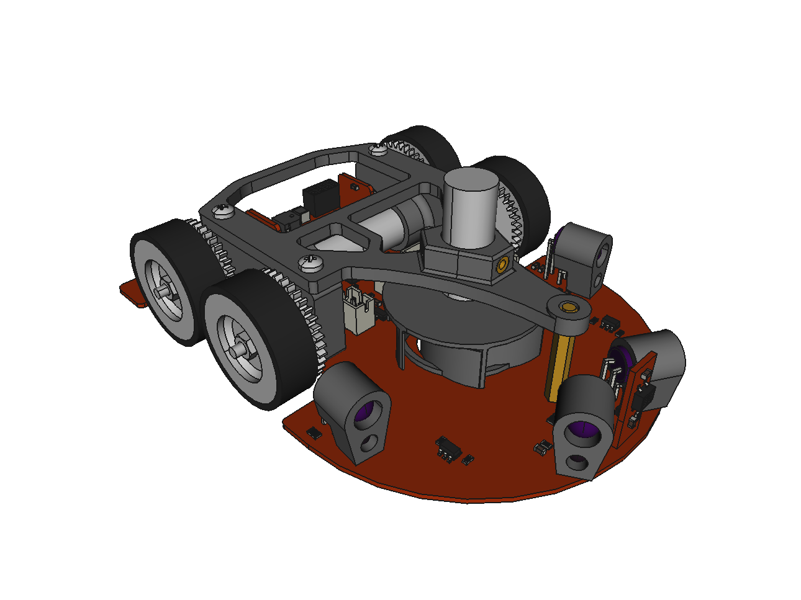
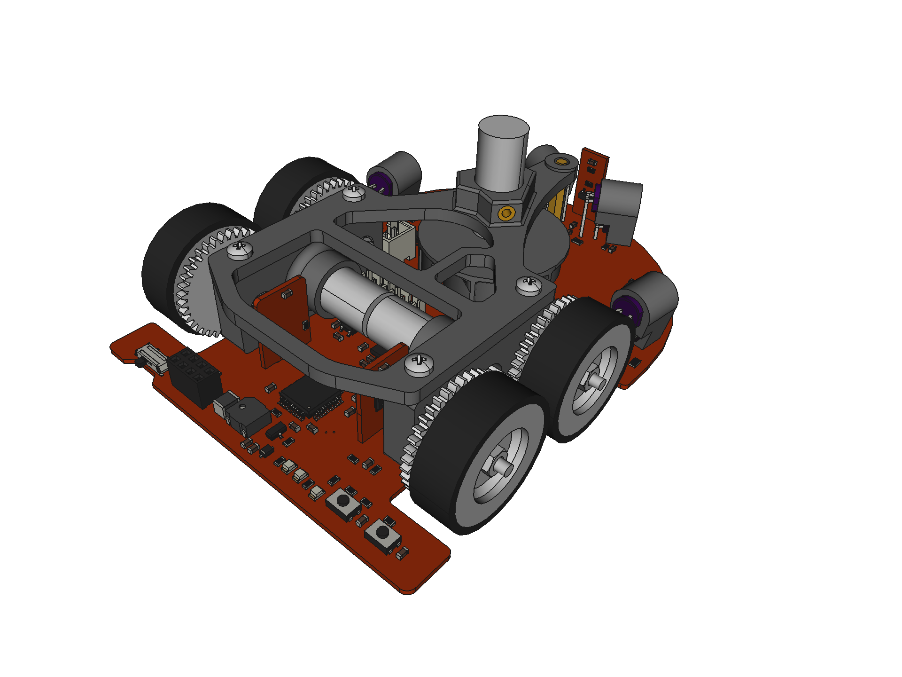
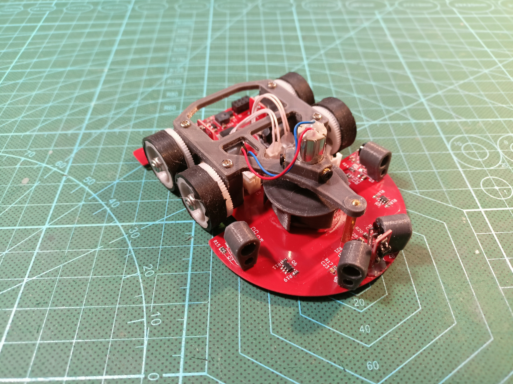
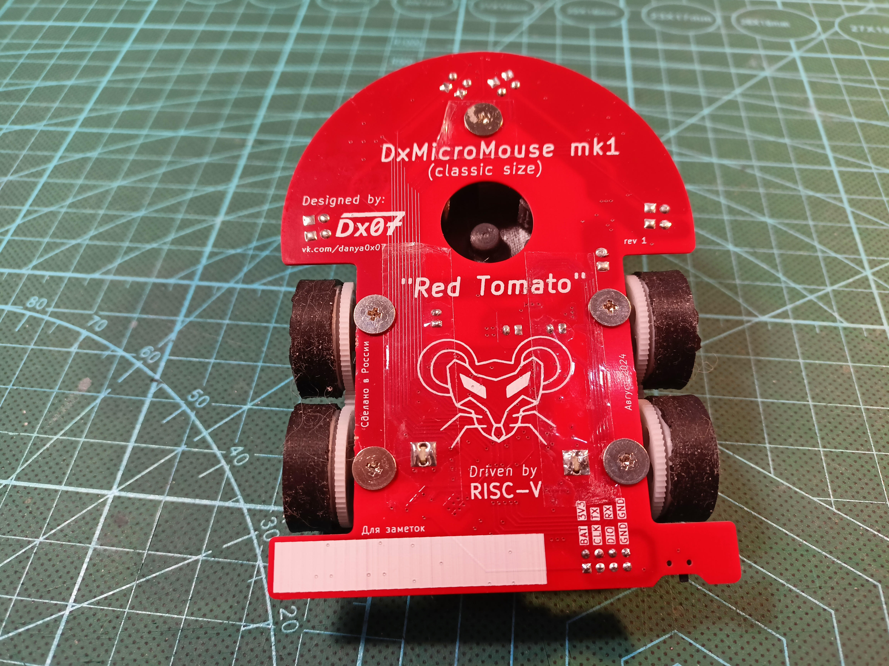
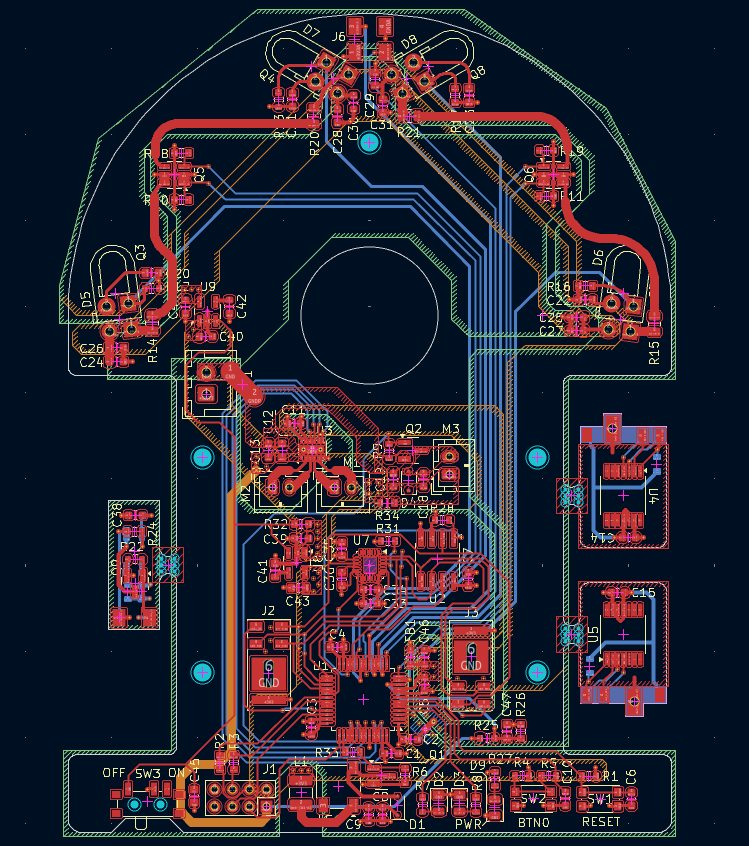

# DxMicroMouse

A robot for autonomous maze solving/racing competition.

For maze solving the floodfill algorithm is used. The software architecture can be divided into layers as
shown below:

For convenient debugging of all subsystems the CLI shell is implemented. Using attachable bluetooth module
remote control and setup is possible e.g. recorded maze map can be easily verified:

## MK1 "Red Tomato"
This is my first micromouse. I made it during my BSc graduate year. Tried to adopt most common
electronics and mechanics design solutions from top-tier open-source US, Japanese and Chinese micromouse robots.

\

| Physical specs |    |
| --- | --- |
| Size | 95x70x35mm |
| Weight | 81g |
| Wheel diameter | 21mm |
| Gear Ratio | 9:64 (M=0.3) |
| Fast mode straight speed | 1.2m/s |
| Fast mode turn speed | 0.6m/s |

[Link to PCB schematic](./doc/pcb/DxMicroMouse_MK1.pdf)

This robot won:
* 1-st place at Robofinist 2025 qualifying stage
* 2-st place at Robofinist 2025 final tournament

